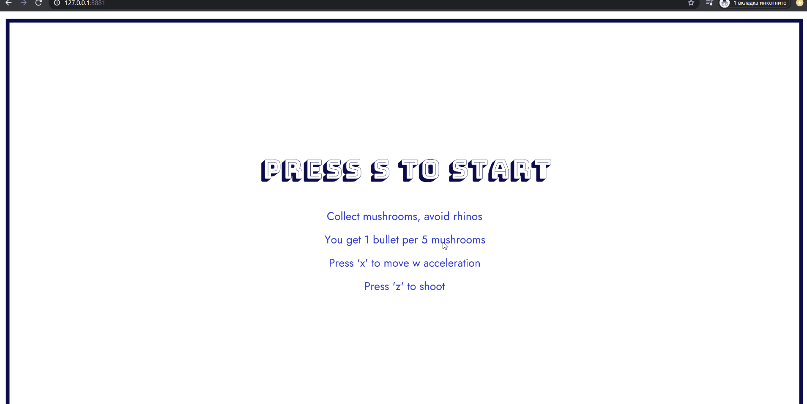

# p5game
p5.js game example for CS101 2020 [NUST MISIS]

1. Download this repo (Big green button 'Clone or download' -> Download ZIP).
2. Unpack files.
3. Run Web Server for Chrome (choose folder with the unpacked files).
4. Use Web Server URL (127.0.0.1:XXXX) to run game in Chrome Browser.

